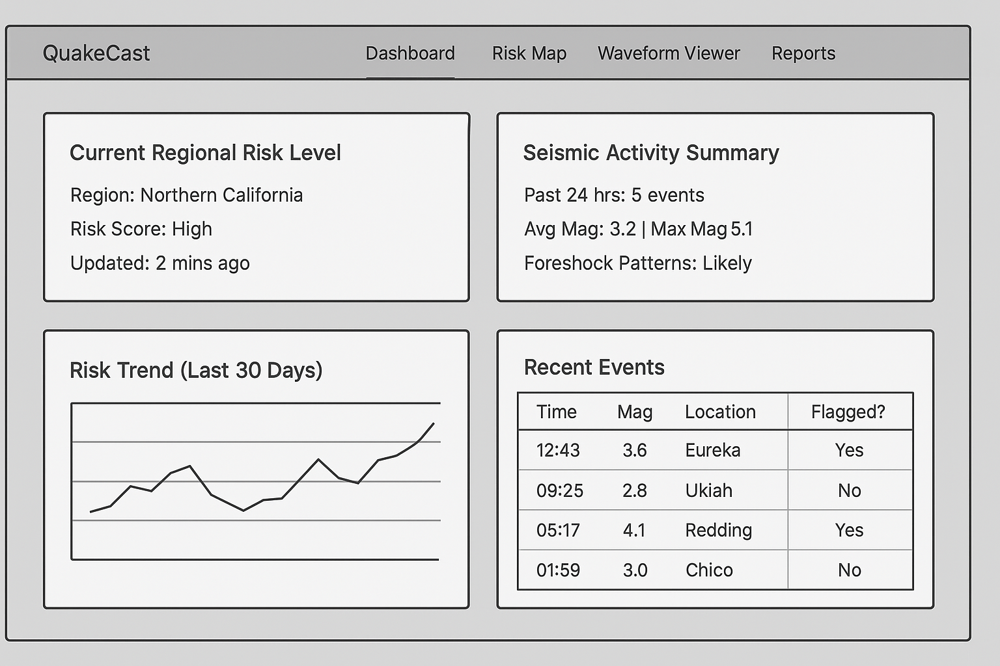

Great! Let’s continue with the **QuakeCast** project. To make progress, I’ll need to know what specific aspect you’d like to work on next. Here are a few directions we could go:

# 🌍 QuakeCast – AI-Powered Earthquake Pattern Detection & Risk Forecasting


**QuakeCast** is a machine learning-powered platform that detects early earthquake precursor patterns using seismic waveform data, satellite imagery, and natural language reports. It leverages Hugging Face models and real-world seismic datasets to provide short-term risk indicators and actionable insights for researchers and emergency planners.

> ⚠️ While not predicting exact earthquakes, QuakeCast identifies anomalies and potential foreshocks to assist in focused monitoring and early warnings.

---

## 🔍 Key Features

- 🔊 **Time-Series Seismic Classification**: Detect low-frequency tremor, foreshocks, and seismic anomalies from waveform data
- 🛰️ **Satellite Imagery Analysis**: Classify ground deformation patterns using InSAR or spectrogram images
- 🧠 **Risk Level Prediction**: Compute region-based short-term earthquake risk scores based on historical and current data
- 📝 **Bulletin Summarization**: Automatically summarize recent earthquake reports using NLP
- 🗺️ **Interactive Dashboard**: Visualize seismic activity, anomaly zones, and real-time waveform inputs

---

## 💡 Real-World Impact

QuakeCast addresses the challenge of early detection in earthquake-prone regions by combining AI with open seismic and geospatial data. It supports:
- Geoscientists analyzing regional activity
- Emergency response teams identifying risk zones
- Urban planners monitoring stress changes near fault lines

---

## 🧠 AI Models and Hugging Face Tasks

| Task                    	| Models/Techniques Used |
|-----------------------------|------------------------|
| Time-Series Classification  | Custom CNN/RNN or adapted `transformers` for waveform features |
| Image Classification    	| `microsoft/beit-base-patch16-224`, `resnet50` on spectrograms |
| Text Summarization      	| `facebook/bart-large-cnn`, `t5-base` for bulletins |
| Anomaly Detection       	| Isolation Forest, Autoencoders (custom) |
| Graph ML (optional)     	| Fault stress propagation with PyTorch Geometric |
| Dataset Sources         	| USGS, IRIS, Sentinel-1 InSAR, Raspberry Shake |

---

## 🛠️ Tech Stack

| Layer 	| Technology |
|-----------|------------|
| Frontend  | React or Angular, TailwindCSS, D3.js |
| Backend   | Python, FastAPI, PyTorch |
| Database  | PostgreSQL or TimescaleDB |
| ML Tools  | Hugging Face Transformers, Scikit-learn |
| Hosting   | Vercel (frontend), Render or AWS (backend) |
| DevOps	| Docker + GitHub Actions |

---

## 📦 Installation

 
# Clone the repo
git clone https://github.com/yourusername/quakecast.git
cd quakecast

# Backend setup
cd backend
python -m venv venv
source venv/bin/activate
pip install -r requirements.txt
uvicorn main:app --reload

# Frontend setup
cd ../frontend
npm install
npm run dev

⚙️ Environment Variables
Create a .env file in the backend folder:
📊 Dashboard Preview
Risk Map View
Waveform Input Analysis


📈 Sample Data Sources
USGS Earthquake Catalog
IRIS Seismic Data
Sentinel-1 InSAR Data 
Raspberry Shake
🧪 Model Evaluation


Model
Task
Accuracy / F1 Score
CNN-RNN
Seismic waveform classification
91% F1
BART-large
Seismic bulletin summarization
ROUGE-L 0.78
ResNet50
Spectrogram classification
88% accuracy


### 🔧 Development Areas

1. **Backend APIs**:

   * Earthquake data ingestion from USGS or IRIS.
   * Signal processing and event detection (e.g., STA/LTA or ML-based).
   * Alerting and event classification.

2. **Frontend Features**:

   * Real-time dashboard for seismic activity.
   * Interactive waveform viewer.
   * Risk map UI with filters (region, magnitude, depth, etc.).

3. **ML & Analysis**:

   * Pattern detection from historical data (e.g., clustering, forecasting).
   * Integration of Hugging Face models (e.g., for waveform classification or anomaly detection).
   * Real-time tremor detection.

4. **Infrastructure & Tools**:

   * Database schema (PostgreSQL + PostGIS?).
   * Alert pipelines (Kafka, WebSockets?).
   * Deployment (Docker, Supabase, or AWS?).

5. **Documentation & Collaboration**:

   * README, user guide, or wireframes.
   * GitHub setup (issues, projects, CI/CD).

## 🚀 Phase 1: Backend APIs + Frontend Features

### 🧩 Tech Stack (initial)

* **Frontend**: Angular + Tailwind CSS + AG Grid (optional)
* **Backend**: Python (FastAPI or Flask)
* **Database**: SQLite (initial) → PostgreSQL/PostGIS (later)
* **Data Source**: USGS Earthquake API ([https://earthquake.usgs.gov/](https://earthquake.usgs.gov/))

---

### 🔁 Backend APIs

#### Initial Features:

1. **Fetch Recent Earthquakes**

   * Endpoint: `GET /earthquakes/recent`
   * Description: Retrieves earthquakes from the last 24 hours.
   * Source: USGS JSON feed ([https://earthquake.usgs.gov/earthquakes/feed/v1.0/summary/all\_day.geojson](https://earthquake.usgs.gov/earthquakes/feed/v1.0/summary/all_day.geojson))

2. **Search Earthquakes**

   * Endpoint: `GET /earthquakes/search`
   * Query params: `starttime`, `endtime`, `minmagnitude`, `maxmagnitude`, `region`, etc.

3. **Event Details**

   * Endpoint: `GET /earthquakes/{id}`
   * Description: Show metadata and waveform link (if available)

---

### 💡 Frontend Features

#### Angular Pages:

1. **Dashboard** (Home)

   * List of recent quakes (table + map view toggle)
   * Filters: magnitude, time, location

    

2. **Event Detail Page**

   * Quake metadata (time, location, magnitude)
   * Show waveform (mock plot first)
   * Risk region overlay (later)
   

3. **Map View**

   * Display events using Leaflet.js or Google Maps
   * Cluster or heatmap view


# 📁 Suggested Folder Structure


```
quakecast/
│
├── backend/
│   ├── main.py
│   ├── api/
│   └── services/
│
├── frontend/
│   ├── src/
│   └── app/
│       ├── dashboard/
│       ├── event-detail/
│       └── shared/
│
└── docs/
    ├── wireframes/
    └── README.md

```
 
Here's a complete example of a **FastAPI backend** endpoint for `GET /earthquakes/recent` that fetches earthquake data from the USGS public feed:

---

### 📁 File: `main.py`

```python
from fastapi import FastAPI, HTTPException
from fastapi.middleware.cors import CORSMiddleware
import requests

app = FastAPI()

# Allow CORS for frontend (adjust for deployment)
app.add_middleware(
    CORSMiddleware,
    allow_origins=["*"],  # Replace with frontend origin in production
    allow_credentials=True,
    allow_methods=["*"],
    allow_headers=["*"],
)

USGS_URL = "https://earthquake.usgs.gov/earthquakes/feed/v1.0/summary/all_day.geojson"

@app.get("/earthquakes/recent")
def get_recent_earthquakes():
    try:
        response = requests.get(USGS_URL)
        response.raise_for_status()
        data = response.json()

        # Simplified response structure
        earthquakes = [
            {
                "id": feature["id"],
                "place": feature["properties"]["place"],
                "time": feature["properties"]["time"],
                "magnitude": feature["properties"]["mag"],
                "depth": feature["geometry"]["coordinates"][2],
                "longitude": feature["geometry"]["coordinates"][0],
                "latitude": feature["geometry"]["coordinates"][1]
            }
            for feature in data["features"]
        ]
        return {"earthquakes": earthquakes}

    except Exception as e:
        raise HTTPException(status_code=500, detail=f"Error fetching data: {str(e)}")
```

---

### 🧪 Test Locally

1. Install FastAPI & Uvicorn:

   ```bash
   pip install fastapi uvicorn requests
   ```

2. Run the server:

   ```bash
   uvicorn main:app --reload
   ```

3. Visit:

   ```
   http://127.0.0.1:8000/earthquakes/recent
   ```

